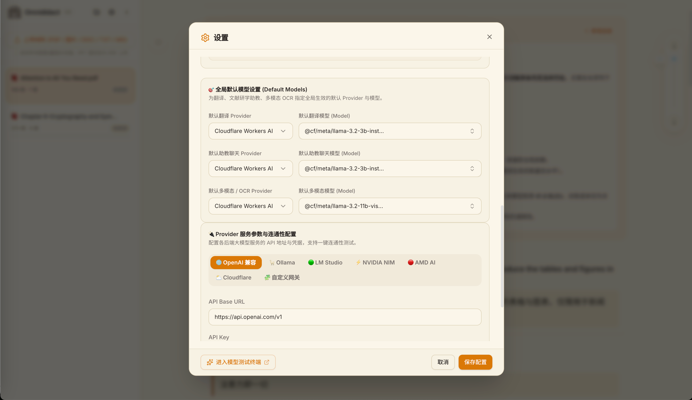
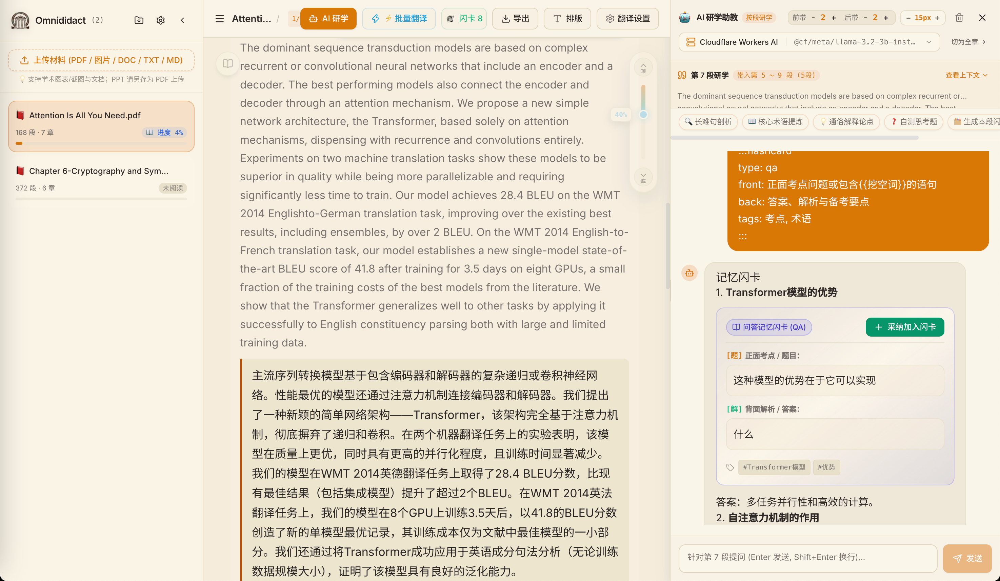
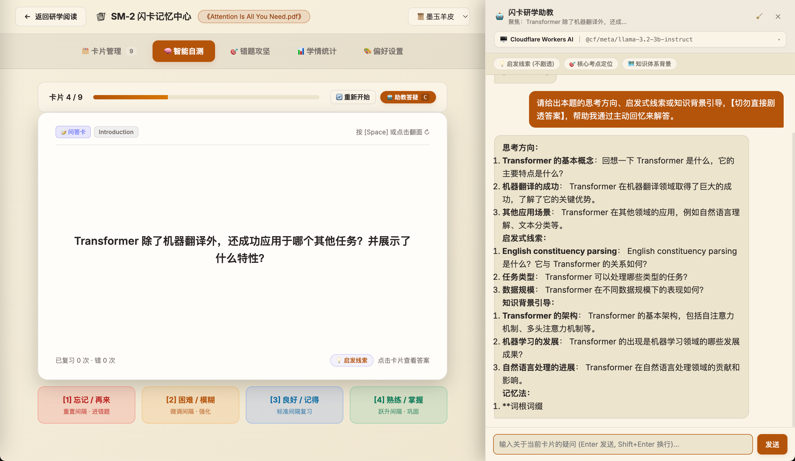

<div align="center">


# Omnididact

### 全材料深度研学与系统化自学助手
**The AI-Powered Deep Study Assistant for Systematically Learning & Mastering Any Material.**

[](LICENSE)
[](https://www.python.org/)
[](https://react.dev/)
[](Dockerfile)
[](#-为什么诞生-omnididact)

[ English ](./README.en.md) | [ 简体中文 ](./README.md)

</div>

---

## 🌟 为什么诞生 Omnididact？

> *"Education is what remains after one has forgotten what one has learned in school." — Albert Einstein*

在面对 800 页的权威技术认证、前沿英文学术论文、晦涩的架构白皮书或外语专著时，每一个严肃的**自学者（Autodidact）**往往都经历过这些痛苦：
* **机翻软件生硬割裂**：长难句生搬硬套、上下文语境丢失、关键术语前后矛盾；
* **“虚假学会”的快餐总结**：市面上的 AI 总结工具把几十页干货压缩成几行干瘪的省流要点，看的时候以为懂了，真正合上书脑中空空，完全没有建立深刻认知；
* **缺乏深度拆解与就地追问**：遇到晦涩逻辑、复杂公式推导或隐藏前提时无处求证，难以由浅入深彻底吃透原作者的思维脉络。

> 💡 **特别说明**：**Omnididact 不是一个“知识库”，也不是来帮你“整理散落笔记”的。**  
> 它的核心使命是作为一个**全材料深度研学助手**：以科学的自学与理解方法论为基石，协助你**逐段推敲、就地追问、解构难点，真正系统性地自学并吃透复杂材料，把硬核知识内化为自己的真本事**。

---

## 🔄 完整的自我教育与研学链路

```
   📥 原始材料                🔍 结构拆解               📖 双语研学
 [PDF/Word/MD/TXT]  ──▶  [目录树与断行缝合]  ──▶  [句段平行中英对照]
                                                        │
                                                        ▼
   🌐 随身离线复习            🗂️ 科学内化               🤖 即时伴读追问
 [单文件/离线自测大厅] ◀──  [SM-2 遗忘曲线自测] ◀──  [就地费曼式答疑解惑]
```

1. **结构拆解**：精准提取 PDF、Word、Markdown 的层级章节、公式图表，自动处理跨页断字缝合（Hyphenation）；
2. **双语精读**：段落级中英平行排版，4 套经典研学护眼主题，让阅读长篇硬核文献成为舒适沉浸的体验；
3. **即时伴读追问（核心）**：段落级带上下文滑动窗口的专属研学私教，随时对长难句、核心论点、工程权衡发起就地费曼式追问与概念解构；
4. **科学自测内化**：从核心概念中提炼互动 3D 闪卡与镂空挖空题（Cloze），基于 **SuperMemo SM-2** 间隔重复算法进行主动回忆自测，巩固长期记忆；
5. **离线成果携带**：所有双语对照、伴读解析与自测卡片均可一键导出为零外部依赖的单文件或离线静态研学成果大厅，断网随身可用，直传 Cloudflare Pages 或 GitHub Pages。

---

## 📸 核心研学流程与图文操作指引 (Visual Workflow)

Omnididact 围绕“**大模型配置 ➔ 材料导入 ➔ 批量翻译与双语精读 ➔ 段落伴读追问 ➔ 闪卡提炼 ➔ SM-2 科学自测**”打造了完整的闭环。以下为核心功能与操作步骤说明：

### 1️⃣ 大模型提供商与服务矩阵配置 (Provider Settings)

系统内置解耦的模型抽象层，支持本地私有大模型与云端 API 无缝协同，并按研学场景精细化分配模型职责：

<div align="center">
  
</div>

* **多源 Provider 统一接入**：原生支持 **OpenAI 兼容协议**（DeepSeek、OpenRouter、SiliconFlow、Moonshot、vLLM）、**本地自建模型**（Ollama、LM Studio）、**企业级及边缘云**（Cloudflare Workers AI、NVIDIA NIM、AMD ROCm）以及自定义网关插件；
* **分工模型灵活指定**：可分别针对 **文本翻译**、**研学伴读助教** 和 **多模态/OCR** 设定默认的 Provider 与对应模型；
* **即时连通性检测**：输入端点或 API Key 后，点击即可一键测试服务连通性，并自动拉取并刷新最新可用模型列表。

---

### 2️⃣ 交互式研学工作台与 AI 伴读 (Study Workbench & Copilot)

访问研学工作台（`/study`），您可以在同一个现代化工作台中一站式完成文档阅读、双语对照、伴读追问、笔记记录与闪卡生成：

<div align="center">
  
</div>

* **📁 文档上传与结构化解析**：
  * 点击左侧 **【➕ 上传材料】**，支持导入 **PDF（文字版/扫描版）、Word (DOCX)、Markdown、TXT**；
  * 引擎自动提取层级目录树并分章，高保真内嵌原版插图与架构图，自动识别并修复跨页断行连字符（Hyphenation）。
* **⚡ 批量翻译与双语平行排版**：
  * 点击顶栏 **【⚡ 批量翻译】** 或章节头部的 **【⚡ 批量翻译本章】**，系统按当前绑定的翻译模型逐段并行沉浸式翻译；
  * 原文与译文采用段落级平行排版，提供**墨玉羊皮（Sepia）**、**深邃夜色（Dark）**等 4 套护眼主题与版心宽度自由调节。
* **🤖 段落 Chat（AI 伴读助教）**：
  * 阅读中遇到长难句、晦涩公式或工程权衡时，点击段落旁的 **【🤖】** 图标即可在右侧唤出伴读抽屉；
  * **滑动上下文窗口**：智能带入当前段落的前后文（支持自由设置前带 $N$ 段、后带 $M$ 段），确保大模型答疑具备宏观上下文脉络；
  * **预置快捷指令胶囊**：提供“长难句剖析”、“核心术语提炼”、“通俗解释论点”、“自测思考题”等一键提问，深入推敲难点。
* **📝 研学笔记与章首导读**：
  * 支持在章首添加“全章导读与学习总结”，支持对任一学术概念划选抓取并撰写富文本笔记。
* **🗂️ 考点闪卡一键提炼**：
  * 伴读助教在拆解段落核心考点后，会自动生成符合记忆规律的问答卡（QA）或镂空填空卡（Cloze）；
  * 只需点击 **【➕ 采纳加入闪卡】**，即可瞬间将其归入当前文档的配套闪卡复习库中。

---

### 3️⃣ SM-2 闪卡科学记忆与启发式自测 (Flashcard Study & SM-2 Retention)

点击顶栏的 **【🗂️ 闪卡】** 进入 **SM-2 闪卡记忆中心**，将阅读理解吸收的知识牢固沉淀为长期记忆：

<div align="center">
  
</div>

* **🎴 3D 真实卡片翻转自测**：
  * 正面展现核心问题或挖空语句，按空格键或点击即可触发 3D 平滑翻转查看反面权威解析；
  * 支持问答卡（QA）与镂空掩码（Cloze），倒逼大脑进行**主动回忆（Active Recall）**。
* **🧠 启发式伴读助教（不剧透答案）**：
  * 自测卡壳时无需直接翻看答案，点击右侧助教的 **【💡 启发线索】**、**【🎯 核心考点定位】** 或 **【🗺️ 知识体系背景】**，AI 导师会提供思维脚手架与背景线索，引导你自主推理并回忆出答案。
* **📈 SuperMemo SM-2 科学遗忘曲线调度**：
  * 自测完成后，根据自我记忆反馈评分：
    * `[1] 忘记 / 再来`（重置复习间隔，自动归入错题攻坚集）
    * `[2] 困难 / 模糊`（微调缩短间隔，近期强化）
    * `[3] 良好 / 记得`（按遗忘曲线标准间隔推进）
    * `[4] 熟练 / 掌握`（跃升复习间隔，进入稳固记忆期）
  * 系统精确计算并安排下一次复习时间，彻底告别“前学后忘”。

---

## 🔥 核心特性一览

### 1. 沉浸式双语研学工作台 (React 19 + TypeScript + Tailwind)
- **极简自适应排版**：支持标准版心（1100px）、紧凑版心（850px）、宽屏与全宽切换，配备字体逐级缩放（A-/A+）；
- **4 套经典研学主题**：默认护眼墨玉羊皮（Sepia）、深邃夜色（Dark）、纯净雅白（Light）、雅致墨绿（Forest）；
- **平滑智能顶栏**：随阅读深度自动渐隐，触顶平滑浮现；全章节目录树秒级跳转。

### 2. 多格式学术文献解析引擎
- **全格式支持**：原生支持 **PDF（文字版与扫描版）、DOCX、Markdown、TXT**；
- **视觉图表保留**：原版插图与架构图完整提取并嵌入 Base64，离线状态下亦可完整展示；
- **排版断裂自动修复**：自动识别 PDF 换行误切断词并无缝缝合，还原流畅语义流。

### 3. 多源大模型矩阵（本地与云端解耦）
内置统一的 Provider 抽象架构，支持一键热切换与连通性测试：
- 🟢 **LM Studio**：本地显卡运行开源大模型（默认 `http://127.0.0.1:1234/v1`）；
- 🦙 **Ollama**：本地极速运行 Llama 3、Qwen 2.5、DeepSeek-R1（默认 `http://127.0.0.1:11434`）；
- 🌐 **OpenAI 兼容协议**：原生直连 DeepSeek、OpenRouter、Moonshot、SiliconFlow、vLLM；
- ⚡ **企业级与边缘云**：支持 Cloudflare Workers AI、NVIDIA NIM、AMD ROCm；
- 🧩 **可插拔插件体系**：通过 `plugins/` 目录可零侵入扩展企业私有网关或专属协议。

### 4. 🎴 交互式 3D 闪卡与 SM-2 记忆算法
<p align="left">
  
  <span>基于 <b>SuperMemo SM-2 间隔重复算法</b> 与 <b>3D 真实卡片翻转</b>，让自学阅读提炼的考点真正跨越艾宾浩斯遗忘曲线。</span>
</p>
- **3D 真实卡片翻转**：正面看问题，背面看深度考点解析，支持快捷键（空格翻转、数字键评分）；
- **Cloze 镂空掩码**：支持核心考点挖空揭晓，刺激主动回忆；
- **SM-2 遗忘曲线调度**：根据自测反馈（重来/困难/良好/容易）智能计算下一次复习周期；
- **闪卡私教伴读**：遇到不会的考点，随时唤起右侧助教提供“启发线索（不剧透答案）”或“记忆口诀”。

### 5. 纯静态离线研学成果与自测大厅导出
- **离线研学大厅（Portal SPA）**：一键将所有研读完成的文献、双语对齐、AI 伴读答疑与自测卡片打包为纯静态站点，支持全站模糊检索、分类筛选与自测进度记忆；
- **零成本随身携带/全球托管**：解压即可直接双击离线打开学习，亦可拖拽至 **Cloudflare Pages**（全球免费 CDN）或部署至 **GitHub Pages / Nginx**；
- **增量 Patch 发布规范**：每消化完一篇新材料，导出增量补丁包，只需放入 `docs/` 并复制粘贴配置到 `docs.json`，秒级完成成果同步，无需全站重新打包！

---

## 🚀 5 分钟极速上手

### 方式一：Docker Compose 一键启动（推荐）
```bash
# 1. 克隆代码
git clone https://github.com/coodajingang/Ominididact.git
cd Ominididact

# 2. 准备配置文件
cp config.example.json config.json

# 3. 后台启动容器
docker compose up -d

# 4. 浏览器访问
# 打开 http://localhost:8000/study
```

### 方式二：本地 Python + 前端源码运行

#### 1. 克隆代码与安装依赖
```bash
git clone https://github.com/coodajingang/Ominididact.git
cd Ominididact

# 创建并激活 Python 虚拟环境
python3 -m venv venv
source venv/bin/activate  # Windows: venv\Scripts\activate

# 安装后端依赖
pip install -r requirements.txt
```

#### 2. 配置大模型 Provider
```bash
# 复制示例配置文件
cp config.example.json config.json
```
在 `config.json` 中配置你常用的大模型（例如填写 DeepSeek API Key 或启动本地 LM Studio / Ollama）。

#### 3. 构建前端并启动服务
```bash
# 构建前端静态产物
cd frontend
npm install
npm run build
cd ..

# 启动 Omnididact 服务
python proxy.py
```
打开浏览器访问：`http://127.0.0.1:8000/study`，即可开启深度研学！

---

## 🌐 离线研学成果导出与自测指南

Omnididact 允许你把所有深入研读、中英对照、AI 深度答疑与自测闪卡的研学成果完整导出为纯静态离线页面，断网环境下也能随时自学复习：

1. **导出全站研学大厅**：在左侧资料库顶部点击 **【📦 导出全站静态多文档知识库包】**（包含所有材料的研读工作台与 3D 自测闪卡）；
2. **离线自学或一键托管**：
   - **完全本地离线**：解压后直接双击 `index.html`，无需启动 Python 后端，在任意浏览器中即可离线查看对照研读与自测闪卡；
   - **部署到 Cloudflare Pages / GitHub Pages**：将解压后的文件夹整体拖入上传，10 秒内即可拥有一个属于自己的全球在线研学自测网站！
3. **后续增量追加新材料**：
   - 研学完新材料后，导出单篇文档的 **【🧩 增量补丁包 (.zip)】**；
   - 将包内 `docs/{doc_id}` 放入站点的 `docs/` 下，将 `patch_entry.json` 内容追加进根目录 `docs.json`，刷新即刻上线！

---

## 📁 核心项目目录结构

```text
omnididact/
├── proxy.py                      # FastAPI 主应用入口
├── config.json                   # 配置文件 (模型服务商、Prompt模板)
├── study/                        # 核心研学引擎模块
│   ├── service.py                # 核心业务层 (组装阅读器/闪卡/全站Zip)
│   ├── parser.py                 # 文档结构化解析与章节拆分
│   ├── flashcard_manager.py      # 闪卡生成、SM-2 算法调度
│   └── ...
├── providers/                    # 统一模型接入层 (OpenAI/Ollama/LM Studio...)
├── plugins/                      # 可扩展网关插件目录
├── templates/
│   ├── portal.html               # 静态多文档研学大厅门户 SPA
│   ├── flashcards.html           # 离线 3D 闪卡交互 SPA
│   └── study.html                # 桌面研学主工作台
├── frontend/                     # React 19 + TypeScript + Tailwind 现代化前端
└── docs/                         # 技术架构白皮书与详细指引
```

---

## 🗺️ 产品规划路线图 (Roadmap)

- [x] 多格式学术文献解析与图文混排高保真提取
- [x] 句段平行双语精读与上下文滑动窗口 AI 助教
- [x] 3D 翻转考点闪卡与 SuperMemo SM-2 科学记忆复现
- [x] 纯静态离线研学成果大厅与增量 Patch 合并规范
- [ ] 知识概念解构与逻辑推导图谱自动生成（Mermaid / 3D 概念脉络图）
- [ ] 导出 Anki 官方 `.apkg` 格式闪卡包

---

## 🤝 参与贡献 (Contributing)

我们非常欢迎社区开发者为 Omnididact 贡献力量！无论是提交 Bug 报告、新增模型 Provider 适配器、优化双语排版样式，还是改进提示词工程，请随时发起 Pull Request 或 Issue。

1. Fork 本仓库并新建分支 (`git checkout -b feature/amazing-feature`)
2. 提交你的修改 (`git commit -m 'feat: Add some amazing feature'`)
3. 推送到你的分支 (`git push origin feature/amazing-feature`)
4. 发起 Pull Request

---

## 📄 开源许可证 (License)

本项目基于 [Apache License 2.0](LICENSE) 协议开源。
